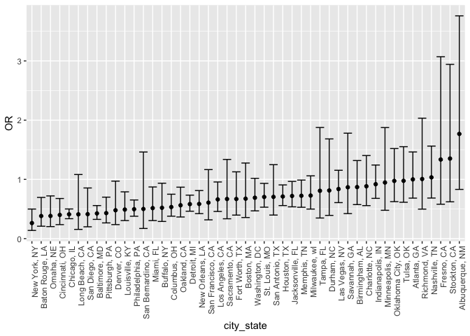
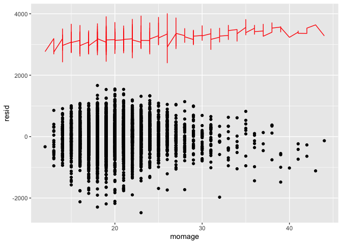
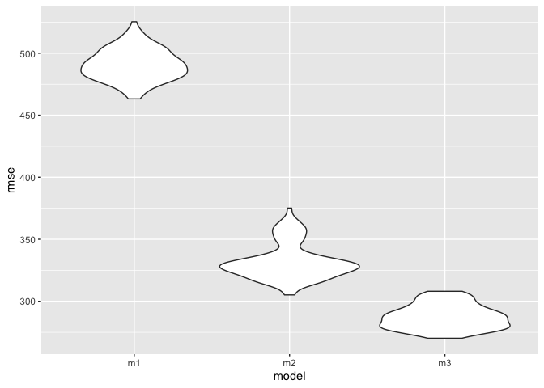
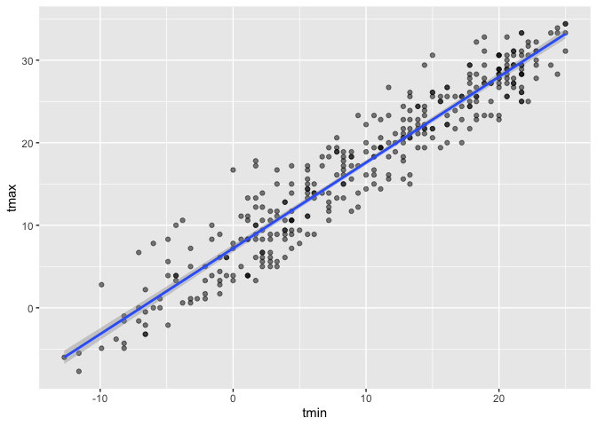
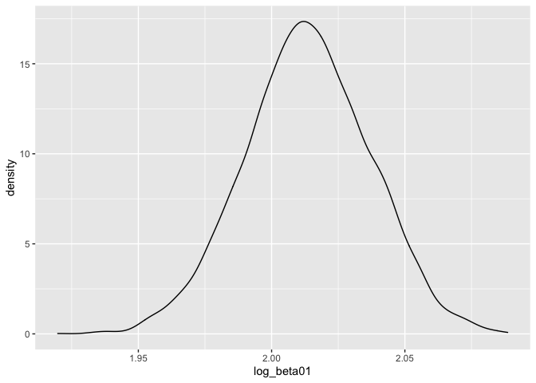
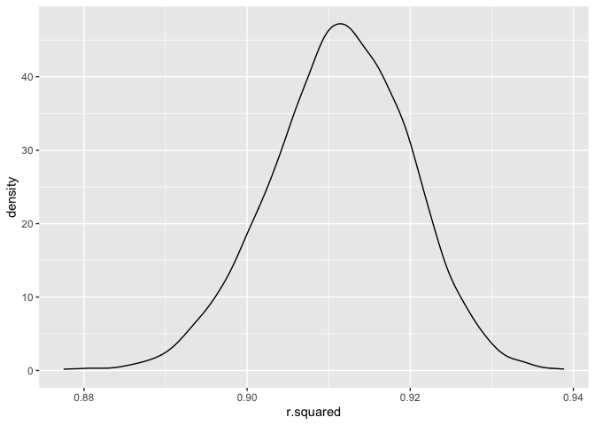

p8105\_hw6\_yl4362
================

``` r
library(tidyverse)
library(modelr)
```

## Problem 1

``` r
homicide_df = 
  read_csv("./data/homicide-data.csv") %>%
  mutate(city_state = str_c(city, state, sep = ", "),
         victim_age = as.numeric(victim_age),
         resolution = case_when(
           disposition == "Closed without arrest" ~ 0,
           disposition == "Open/No arrest" ~0,
           disposition == "Closed by arrest" ~1
         )) %>%
  filter(city_state != "Tulsa, AL",
         victim_race %in% c("White", "Black")) %>%
  select(city_state, resolution, victim_age, victim_sex, victim_race)
```

    ## Parsed with column specification:
    ## cols(
    ##   uid = col_character(),
    ##   reported_date = col_double(),
    ##   victim_last = col_character(),
    ##   victim_first = col_character(),
    ##   victim_race = col_character(),
    ##   victim_age = col_character(),
    ##   victim_sex = col_character(),
    ##   city = col_character(),
    ##   state = col_character(),
    ##   lat = col_double(),
    ##   lon = col_double(),
    ##   disposition = col_character()
    ## )

    ## Warning: Problem with `mutate()` input `victim_age`.
    ## ℹ NAs introduced by coercion
    ## ℹ Input `victim_age` is `as.numeric(victim_age)`.

    ## Warning in mask$eval_all_mutate(dots[[i]]): NAs introduced by coercion

``` r
homicide_baltimore = 
  homicide_df %>%
  filter(city_state == "Baltimore, MD")

glm(resolution ~ victim_age + victim_race + victim_sex, 
    data = homicide_baltimore, 
    family = binomial()) %>%
  broom::tidy() %>%
  mutate(
    OR = exp(estimate),
    CI_lower = exp(estimate - 1.96 * std.error),
    CI_upper = exp(estimate + 1.96 * std.error)
    ) %>%
  select(term, OR, starts_with("CI")) %>%
  knitr::kable(digits = 3)
```

| term              |    OR | CI\_lower | CI\_upper |
| :---------------- | ----: | --------: | --------: |
| (Intercept)       | 1.363 |     0.975 |     1.907 |
| victim\_age       | 0.993 |     0.987 |     1.000 |
| victim\_raceWhite | 2.320 |     1.648 |     3.268 |
| victim\_sexMale   | 0.426 |     0.325 |     0.558 |

``` r
models_results_df = 
  homicide_df %>%
  nest(data = -city_state) %>%
  mutate(
    models = 
      map(.x = data, ~glm(resolution ~ victim_age + victim_race + victim_sex, 
    data = .x, 
    family = binomial())),
    results = map(models, broom::tidy)
  ) %>%
  select(city_state, results) %>%
  unnest(results) %>%
  mutate(
    OR = exp(estimate),
    CI_lower = exp(estimate - 1.96 * std.error),
    CI_upper = exp(estimate + 1.96 * std.error)
    ) %>%
  select(city_state, term, OR, starts_with("CI"))

models_results_df %>%
  filter(term == "victim_sexMale") %>%
  mutate(city_state = fct_reorder(city_state, OR)) %>%
  ggplot(aes(x = city_state, y = OR)) +
  geom_point() +
  geom_errorbar(aes(ymin = CI_lower, ymax = CI_upper)) +
  theme(axis.text.x = element_text(angle = 90, hjust = 1))
```

<!-- -->

## Problem 2

``` r
birthweight_df = 
  read_csv("./data/birthweight.csv") %>%
  mutate(
    babysex = case_when(
      babysex == 1 ~ "male",
      babysex == 2 ~ "female"
    )
  ) %>%
  drop_na(blength, gaweeks, bhead, babysex)
```

    ## Parsed with column specification:
    ## cols(
    ##   .default = col_double()
    ## )

    ## See spec(...) for full column specifications.

``` r
m1 =
  lm(bwt ~ momage + wtgain, data = birthweight_df)

m1 %>%
  broom::tidy() %>%
  select(term, estimate, p.value)
```

    ## # A tibble: 3 x 3
    ##   term        estimate  p.value
    ##   <chr>          <dbl>    <dbl>
    ## 1 (Intercept)   2418.  0.      
    ## 2 momage          21.0 2.43e-27
    ## 3 wtgain          12.2 1.89e-69

``` r
birthweight_df %>%
  modelr::add_residuals(m1) %>%
  modelr::add_predictions(m1) %>%
  ggplot(aes(x = momage, y = resid)) + 
  geom_point() +
  geom_line(aes(y = pred), color = "red")
```

<!-- --> In
the `m1` model, I used mom’s gained weight and mom’s age as predictors.

``` r
cv_df =
  crossv_mc(birthweight_df, 100) %>% 
  mutate(
    train = map(train, as_tibble),
    test = map(test, as_tibble))

cv_df = 
  cv_df %>% 
  mutate(
    m1_mod = map(train, ~lm(bwt ~ momage + wtgain, data = .x)),
    m2_mod = map(train, ~lm(bwt ~ blength + gaweeks, data = .x)),
    m3_mod = map(train, ~lm(bwt ~ bhead * blength + bhead * babysex + blength * babysex + bhead * blength * babysex, data = .x))
    ) %>% 
  mutate(
    rmse_m1 = map2_dbl(m1_mod, test, ~rmse(model = .x, data = .y)),
    rmse_m2 = map2_dbl(m2_mod, test, ~rmse(model = .x, data = .y)),
    rmse_m3 = map2_dbl(m3_mod, test, ~rmse(model = .x, data = .y)))

cv_df %>% 
  select(starts_with("rmse")) %>% 
  pivot_longer(
    everything(),
    names_to = "model", 
    values_to = "rmse",
    names_prefix = "rmse_") %>% 
  mutate(model = fct_inorder(model)) %>% 
  ggplot(aes(x = model, y = rmse)) + geom_violin()
```

<!-- --> The
RMSEs are suggestive that `m3` model works best.

## Problem 3

``` r
weather_df = 
  rnoaa::meteo_pull_monitors(
    c("USW00094728"),
    var = c("PRCP", "TMIN", "TMAX"), 
    date_min = "2017-01-01",
    date_max = "2017-12-31") %>%
  mutate(
    name = recode(id, USW00094728 = "CentralPark_NY"),
    tmin = tmin / 10,
    tmax = tmax / 10) %>%
  select(name, id, everything())
```

    ## Registered S3 method overwritten by 'hoardr':
    ##   method           from
    ##   print.cache_info httr

    ## using cached file: /Users/sivona/Library/Caches/R/noaa_ghcnd/USW00094728.dly

    ## date created (size, mb): 2020-12-08 21:09:56 (7.536)

    ## file min/max dates: 1869-01-01 / 2020-12-31

``` r
weather_df %>% 
  ggplot(aes(x = tmin, y = tmax)) + 
  geom_point(alpha = .5) +
  stat_smooth(method = "lm")
```

    ## `geom_smooth()` using formula 'y ~ x'

<!-- -->

### log\_(beta0\*beta1)

``` r
log_beta =
  weather_df %>%
  modelr::bootstrap(n = 5000) %>%
  mutate(
    models = map(strap, ~lm(tmax ~ tmin, data = .x)),
    results = map(models, broom::tidy)) %>%
  select(-strap, -models) %>%
  unnest(results) %>%
  select(.id, term, estimate) %>%
  pivot_wider(
    names_from = term,
    values_from = estimate,
    values_fn = list
  ) %>%
  mutate(
    intercept = as.numeric(`(Intercept)`),
    tmin = as.numeric(tmin),
    log_beta01 = log(intercept * tmin)) %>%
  select(log_beta01)

log_beta_distribution =
  log_beta %>%
  ggplot(aes(x = log_beta01)) + geom_density()

log_beta_distribution
```

<!-- -->

``` r
log_beta %>%
  summarize(ci_lower = quantile(log_beta01, 0.025), 
    ci_upper = quantile(log_beta01, 0.975)) %>%
  knitr::kable(digits = 3)
```

| ci\_lower | ci\_upper |
| --------: | --------: |
|     1.967 |     2.058 |

From the log\_beta\_distribution plot, we can see most of the values of
log(beta0\*beta1) are between 1.95 and 2.05 The 95% CI for r\_squared is
(1.964, 2.058).

### r\_squared

``` r
r_2 = 
  weather_df %>%
  modelr::bootstrap(n = 5000) %>%
  mutate(
    models = map(strap, ~lm(tmax ~ tmin, data = .x)),
    results = map(models, broom::glance)) %>%
  select(-strap, -models) %>%
  unnest(results) %>%
  select(r.squared) 

r_2_distribution =
  r_2 %>%
  ggplot(aes(x = r.squared)) + geom_density()

r_2_distribution
```

<!-- -->

``` r
r_2 %>%
  summarize(ci_lower = quantile(r.squared, 0.025), 
    ci_upper = quantile(r.squared, 0.975)) %>%
  knitr::kable(digits = 3)
```

| ci\_lower | ci\_upper |
| --------: | --------: |
|     0.894 |     0.927 |

From the r\_2\_distribution plot, we can see most of the values of
r\_squared are between 0.90 and 0.92. The 95% CI for r\_squared is
(0.894, 0.927).
